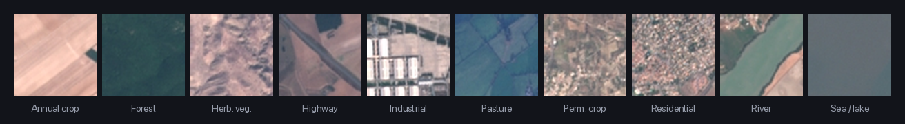
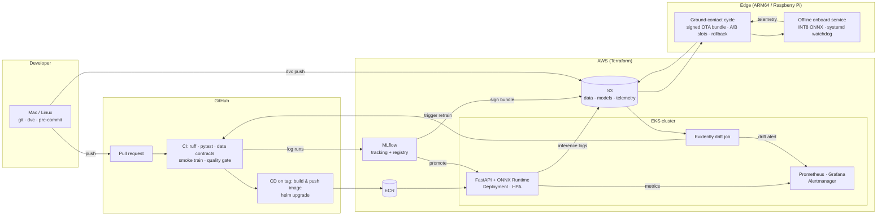
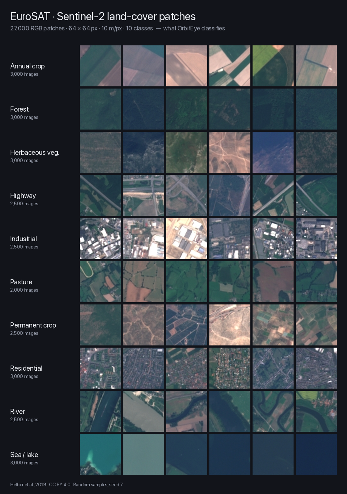

<div align="center">

# 🛰️ OrbitEye

**End-to-end MLOps for satellite land-cover classification — from experiment tracking to a Kubernetes service and an offline edge device.**

[](#the-ml-lifecycle-stage-by-stage)
[](https://www.python.org/)
[](https://pytorch.org/)
[](https://onnxruntime.ai/)
[](https://www.docker.com/)
[](https://kubernetes.io/)
[](https://www.terraform.io/)
[](https://aws.amazon.com/)
[](https://mlflow.org/)
[](https://dvc.org/)
[](https://github.com/astral-sh/ruff)
[](LICENSE)

<!-- Enable once the workflows exist (stage 4 / stage 8):
[](https://github.com/alichr/orbiteye/actions/workflows/ci.yml)
[](https://github.com/alichr/orbiteye/actions/workflows/release.yml)
[](https://github.com/alichr/orbiteye/actions/workflows/edge.yml)
-->

[Architecture](#architecture) · [Dataset](#the-data) · [Skills demonstrated](#skills-demonstrated) · [Results](#results) · [Quickstart](#quickstart) · [Lifecycle](#the-ml-lifecycle-stage-by-stage) · [Design decisions](#design-decisions) · [Docs](docs/)

<br/>



</div>

---

## What this is

OrbitEye classifies 64×64 Sentinel-2 satellite patches into 10 land-cover classes ([EuroSAT](https://github.com/phelber/EuroSAT)).
The model is deliberately simple — a fine-tuned ResNet-18, later distilled into MobileNetV3 for the edge — because **the point of this repository is everything around the model**:

- reproducible data and experiment management,
- containerised training and serving,
- CI/CD with automated model-quality gates,
- infrastructure as code on AWS (with an equivalent deployment on Azure),
- a Kubernetes inference service with autoscaling, monitoring and drift-triggered retraining,
- and an offline, watchdog-supervised edge service for ARM64 / Raspberry Pi with signed over-the-air model updates, designed around onboard-satellite constraints.

Every stage is built, tested and documented so that a reviewer can trace a single commit from a pull request to a running endpoint.

> **Status:** 🚧 in active development. The [lifecycle table](#the-ml-lifecycle-stage-by-stage) below shows exactly which stages are complete. Nothing is claimed here that is not in the repo.

---

## Architecture



---

## The data

[EuroSAT](https://github.com/phelber/EuroSAT) (Helber et al., 2019) is 27,000 georeferenced Sentinel-2 patches covering 34 European countries, 64 × 64 px at 10 m ground resolution, labelled with ten land-cover classes. It is small enough to train on a laptop and realistic enough to exercise every part of the pipeline: class imbalance, seasonal and atmospheric shift for the drift story, and a real remote-sensing modality for the onboard-satellite edge stage.

<div align="center">

</div>

| Property | Value |
|---|---|
| Source | Sentinel-2 Level-2A, RGB bands (B04, B03, B02) |
| Patches | 27,000 (2,000 – 3,000 per class) |
| Resolution | 64 × 64 px · 10 m/px |
| Classes | Annual crop, Forest, Herbaceous vegetation, Highway, Industrial, Pasture, Permanent crop, Residential, River, Sea/lake |
| Split | 70 / 15 / 15 train / val / test, stratified, frozen and versioned with DVC |
| Licence | CC BY 4.0 |

Data never lives in git. It is versioned with DVC and pulled from S3 (MinIO locally); the exact split used for every reported number is pinned by a commit hash.

---

## Skills demonstrated

Each skill maps to concrete, reviewable artefacts in this repository.

| Skill | Where to look | Evidence |
|---|---|---|
| **Linux / Git** | whole repo, [`Makefile`](Makefile), [`.pre-commit-config.yaml`](.pre-commit-config.yaml) | Protected `main`, PR-only workflow, conventional commits, pre-commit hooks, headless provisioning scripts in [`edge/provision/`](edge/provision/) |
| **ML design & reproducibility** | [`docs/DESIGN.md`](docs/DESIGN.md), [`dvc.yaml`](dvc.yaml), [`configs/`](configs/) | Problem framing, data & model cards, `dvc repro` rebuilds any past result from a commit hash |
| **Experiment tracking** | [`src/orbiteye/train.py`](src/orbiteye/train.py) | MLflow params/metrics/artefacts, model registry with Staging → Production promotion |
| **Docker** | [`docker/`](docker/), [`docker-compose.yml`](docker-compose.yml) | Multi-stage builds, non-root, pinned digests, < 1 GB serving image, Trivy-scanned, multi-arch (amd64 + arm64) |
| **CI/CD** | [`.github/workflows/`](.github/workflows/) | Lint → tests → data contracts → smoke training → **model quality gate** → image build → Helm deploy on tag; scheduled retraining |
| **AWS** | [`infra/aws/`](infra/aws/) | Terraform: S3, ECR, EKS, EC2, IAM with GitHub OIDC (no long-lived keys), budget alarms |
| **Azure** | [`infra/azure/`](infra/azure/) | Same serving container on Azure Container Apps; managed training job on Azure ML |
| **Kubernetes** | [`deploy/helm/orbiteye/`](deploy/helm/orbiteye/), [`deploy/kind/`](deploy/kind/) | Helm chart, probes, resource limits, HPA, rolling updates & rollback, RBAC; local `kind` → EKS |
| **Model serving** | [`serving/`](serving/) | FastAPI + ONNX Runtime, Pydantic validation, `/healthz` `/readyz` `/metrics`, load-tested with k6 |
| **Model monitoring** | [`deploy/monitoring/`](deploy/monitoring/), [`docs/RUNBOOK.md`](docs/RUNBOOK.md) | Prometheus + Grafana dashboards (committed as JSON), Alertmanager rules, Evidently data-drift reports, drift → automated retraining |
| **Edge deployment** | [`edge/`](edge/) | INT8 ONNX quantisation & distillation, arm64 image, offline `systemd` service with watchdog, signed OTA updates with A/B rollback, 24 h soak test, validated under ARM64 emulation |

---

## Results

<!-- Tables are filled in as each stage completes. Numbers come from scripts in the repo, never typed by hand. -->

### Model quality (EuroSAT test split)

| Model | Params | Accuracy | Macro-F1 | Notes |
|---|---|---|---|---|
| ResNet-18 (baseline) | 11.2 M | _TBD_ | _TBD_ | `configs/baseline.yaml` |
| MobileNetV3-small (distilled) | 1.5 M | _TBD_ | _TBD_ | edge student model |

### Serving under load (EKS, k6, 2 vCPU pods)

| Replicas | RPS | p50 (ms) | p95 (ms) | p99 (ms) | Error rate |
|---|---|---|---|---|---|
| 1 | _TBD_ | _TBD_ | _TBD_ | _TBD_ | _TBD_ |
| 4 (HPA) | _TBD_ | _TBD_ | _TBD_ | _TBD_ | _TBD_ |

### Edge optimisation (ARM64, CPU only)

| Variant | Size (MB) | Accuracy | p50 latency (ms) | RSS (MB) |
|---|---|---|---|---|
| FP32 ONNX | _TBD_ | _TBD_ | _TBD_ | _TBD_ |
| INT8 ONNX | _TBD_ | _TBD_ | _TBD_ | _TBD_ |
| Distilled INT8 ONNX | _TBD_ | _TBD_ | _TBD_ | _TBD_ |

> Edge latency is measured under QEMU ARM64 emulation on an x86/Apple host; absolute numbers are not representative of a real Raspberry Pi, relative numbers are. See [`edge/README.md`](edge/README.md).

---

## Quickstart

```bash
# 1. Clone and install
git clone https://github.com/alichr/orbiteye.git && cd orbiteye
make setup            # creates .venv, installs deps, installs pre-commit hooks

# 2. Get the data and reproduce the baseline
dvc pull              # pulls versioned EuroSAT data from the remote
dvc repro             # prepare -> train -> evaluate, logs to MLflow

# 3. Track experiments locally
docker compose up -d  # MLflow + Postgres + MinIO
open http://localhost:5000

# 4. Serve the model locally
make serve            # FastAPI + ONNX Runtime on :8000
curl -F "file=@samples/forest.jpg" localhost:8000/predict

# 5. Deploy to a local Kubernetes cluster
make kind-up          # kind cluster + Helm install + Prometheus/Grafana
make load-test        # k6, watch the HPA scale

# 6. Build and test the edge image (no hardware needed)
make edge-build       # docker buildx --platform linux/arm64
make edge-test        # runs edge test-suite under ARM64 emulation
```

Full instructions per component live in each directory's `README.md`.

---

## The ML lifecycle, stage by stage

The project was built in deliberate stages, one skill at a time. Each stage has a checklist that had to be fully green before the next one started. The complete curriculum is in [`docs/LEARNING_PLAN.md`](docs/LEARNING_PLAN.md).

| # | Stage | Key artefacts | Status |
|---|---|---|---|
| 1 | Linux & Git foundations | repo skeleton, pre-commit, PR workflow | 🟨 |
| 2 | ML design, DVC, MLflow | `DESIGN.md`, `dvc.yaml`, tracked baseline | ⬜ |
| 3 | Docker | train/serve images, compose tracking stack | ⬜ |
| 4 | CI/CD | `ci.yml`, `release.yml`, quality gate | ⬜ |
| 5 | Cloud: AWS (+ Azure) | Terraform modules, OIDC, remote MLflow | ⬜ |
| 6 | Kubernetes & serving | Helm chart, kind → EKS, HPA, rollback drill | ⬜ |
| 7 | Monitoring | Grafana dashboards, drift job, runbook | ⬜ |
| 8 | Edge deployment | INT8 export, arm64 image, onboard service, OTA cycle | ⬜ |
| 9 | Capstone | ADRs, results, demo video | ⬜ |

Legend: ⬜ not started · 🟨 in progress · ✅ complete

---

## Design decisions

Short architecture decision records live in [`docs/adr/`](docs/adr/). Highlights:

- **ONNX Runtime over TorchServe / Triton** — one artefact runs unchanged on x86 cloud pods and ARM64 edge devices; no framework dependency at inference time.
- **Model pulled from the registry at startup in the cloud, baked into the image at the edge** — cloud favours fast rollouts and rollbacks; the edge favours reproducible, offline, signed bundles.
- **GitHub OIDC instead of stored cloud credentials** — CI assumes a short-lived IAM role; there is no long-lived secret in the repo or in GitHub.
- **Quality gate in CI, not in a notebook** — a PR that drops macro-F1 below the threshold on the frozen evaluation set cannot merge.
- **Raspberry Pi class hardware as the edge target** — CPU-only ARM with a tight power budget and no reliable network mirrors the constraints of CubeSat payload computers; the design follows ESA Φ-sat-1 and OPS-SAT patterns (offline inference, telemetry buffering, updates only during ground contact).

---

## Onboard-satellite constraints, made explicit

The edge service is designed and tested against constraints a real onboard system would impose:

| Constraint | How OrbitEye handles it | Verified by |
|---|---|---|
| No network during inference | Onboard mode never opens a socket; all I/O is local files | unit test + `strace` in CI |
| Radiation / random faults | `systemd` watchdog, `Restart=on-failure`, idempotent restart | `kill -9` drill |
| Fixed memory & power budget | Pre-allocated buffers, INT8 model, per-frame time budget | 24 h soak test asserts flat RSS |
| Intermittent ground contact | Append-only telemetry log, uplink on contact | `ground/uplink.py` tests |
| Untrusted update channel | Ed25519-signed model bundles, A/B slots, self-test, auto-rollback | tampered-bundle test |

---

## Repository layout

```
orbiteye/
├── src/orbiteye/      training, evaluation, export
├── configs/           experiment configs (Hydra)
├── docker/            Dockerfiles for train / serve
├── serving/           FastAPI + ONNX Runtime inference service
├── deploy/            Helm chart, kind setup, monitoring stack
├── infra/             Terraform for AWS and Azure
├── edge/              quantisation, arm64 image, onboard service, OTA cycle
├── tests/             unit, contract and integration tests
├── .github/workflows/ CI, release, edge, nightly retraining
└── docs/              DESIGN.md, RUNBOOK.md, ADRs, learning plan
```

---

## Honesty notes

- Cloud resources are torn down between demos; everything can be recreated with `terraform apply`. Screenshots of live deployments are in [`docs/assets/`](docs/assets/).
- AWS is the primary cloud and is covered in depth. The Azure deployment is real but thinner: the same container on Azure Container Apps plus one Azure ML training job.
- The edge stack is validated under ARM64 emulation. No physical Raspberry Pi was used; the image is ready to flash and the provisioning steps are documented and tested in an emulated Raspberry Pi OS.

---

## Author

**Ali Cheraghian** — [GitHub](https://github.com/alichr) · [LinkedIn](https://www.linkedin.com/in/ali-cheraghian) · ali.cheraghian@mq.edu.au

Built as a hands-on, end-to-end MLOps study: design → train → package → ship → monitor → deploy to the edge.

Licensed under the [MIT License](LICENSE).
